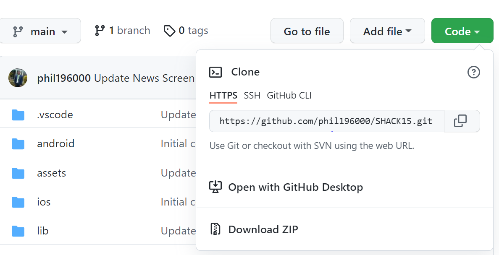
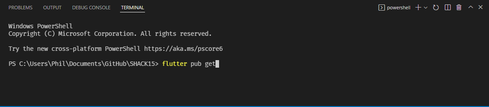

# shack15

A new Flutter project.

## Getting Started

This project is a starting point for a Flutter application.

A few resources to get you started if this is your first Flutter project:

- [Lab: Write your first Flutter app](https://flutter.dev/docs/get-started/codelab)
- [Cookbook: Useful Flutter samples](https://flutter.dev/docs/cookbook)

For help getting started with Flutter, view our
[online documentation](https://flutter.dev/docs), which offers tutorials,
samples, guidance on mobile development, and a full API reference.

## How to Run this project:

- Click on the Code dropdown picker and choose an option to clone the project to your computer. Check the image below as reference

  

- After cloning the project, setup your computer to run flutter applications by visiting the [Get Started](https://docs.flutter.dev/get-started/install) page.

- After setting up your computer, depending on the option you chose to at the cloning step, you might have to execute an extra step:
  - if you chose **Download Zip**, extract the Zipped file.
- Open the cloned/extracted project in a **Code Editor**, if you do not have a code editor, I will recommend [Visual Studio Code](https://code.visualstudio.com/)
- Open a terminal and change directory to the project's root folder and run **_flutter pub get_**. Check image below for reference
  
- After its done, run **_flutter run_** in the terminal to run the flutter application.
- If all the steps were followed, you will have the application running on an available device(Emulator or Physical Device)
- You should see the screen below, when the application runs:
  
